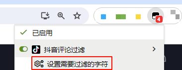

## 介绍
这是一个可以自定义过滤抖音评论的工具。

## 教程
1. [安装脚本](https://greasyfork.org/zh-CN/scripts/488322)
2. 设置需要过滤的字符（使用,分割）
3. 打开抖音网页版，浏览评论区
4. 脚本将自动隐藏带有过滤字符的评论

## 声明
本工具仅做学习交流，严禁用于商业用途。

## 贡献
欢迎提出意见与建议，可以提交**Issue**，要求如下：
- 避免重复
- 语言清晰明确

如果可以，请直接提交**Pull Request**，要求如下：
- 无需修改`version`
- 描述清楚做了什么